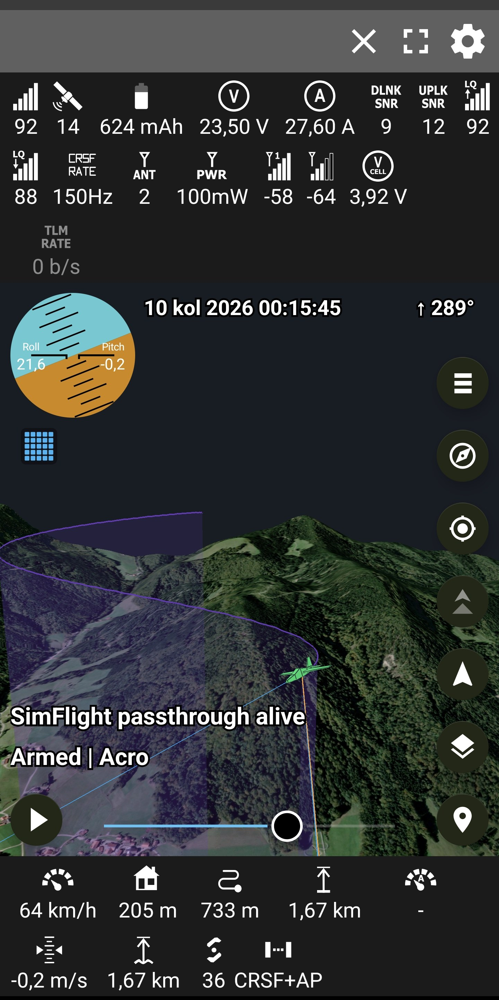

# Android Telemetry Viewer 2.4.1

Live and recorded RC telemetry on a smooth 2D map or real 3D terrain.

This is [juricabi's fork](https://github.com/juricabi/android-taranis-smartport-telemetry).
It supports FrSky S.PORT, CRSF/Tracer/ExpressLRS, Ghost, LTM and MAVLink 1/2 over
Bluetooth, BLE, USB serial and network connections.

**Download:** [GitHub Releases](https://github.com/juricabi/android-taranis-smartport-telemetry/releases)

<p align="center">
  
</p>

## Current state

Version 2.4.1: the 2.4.0 ground and map, with the flight ending when you
say so, a map that no longer turns to rainbow, a row that names the
protocol the link speaks, the 3D ground no longer hanging a wall as it
loads, and one camera that behaves the same across both views, live or
replayed.

- 3D terrain is a quadtree of web-mercator tiles — the Google Earth and
  Cesium design — metre-sharp under the model, coarse where it can afford
  to be, with morphed levels and dissolving pictures.
- The nearest missing ground loads first and shows the moment it is
  finished; shaded relief gives the mountains' shape in the first second.
- The world follows the flight: a flight far from the phone re-anchors
  the 3D world to itself.
- Switching views parks the 3D world instead of destroying it; switching
  back takes seconds. About three gigabytes of ground persist on disk.
- The 2D map loads everywhere again: the location arrows are ordinary map
  symbols now, whose old native layer stopped tiles on some devices.
- Memory-stable by audit: every queue and cache bounded, the heap idles
  near a third of what it used to hold.
- A flight ends when you say so: Disconnect clears it — a link that drops
  keeps everything for walking to a downed model — and nothing is thrown
  away when nothing was recorded. The camera stays where you left it; only
  a flight far from where you stand rebuilds the 3D world back at you.
- The bottom row names the protocol the link speaks — FrSky, CRSF, GHST,
  LTM, MAV v1, MAV v2, MAV HL, and CRSF+AP when an autopilot is talking
  over the link. Off by default, in Sensor display settings.
- ArduPilot passthrough over CRSF/ExpressLRS and MAVLink High Latency
  carry full telemetry over plain ELRS or satellite/LoRa-class links.
- Every protocol decoder is covered by regression tests, longitude
  included: the maths crosses the 180th meridian and is held up by tests
  that fail on the old arithmetic.
- The 3D ground no longer hangs a dark wall while it loads: that shelf was
  a coarse tile's skirt, drawn down edges where the finer ground below had
  already risen to meet it. Skirts now hang only where a crack can open.
- One camera contract across both views, live or replayed: a flight is
  framed the moment it appears in every mode, a replay opens in the mode
  last chosen, the mode is remembered between runs, and with no mode
  keeping up zoom reaches the ground and pan keeps pace. A dropped link's
  reconnect lets go the moment you connect or open a replay.

## Supported telemetry

| Protocol | Main data |
|---|---|
| FrSky S.PORT | GPS, altitude, vario, airspeed, battery, current and sensors |
| CRSF / Crossfire / Tracer / ExpressLRS | GPS, attitude, flight mode, battery, RC and link statistics |
| Ghost (GHST) | GPS, battery and Ghost link statistics/profile |
| LTM | GPS, attitude, status and battery |
| MAVLink 1 and 2 | GPS, global position, attitude, battery, radio, flight mode and status text |
| ArduPilot passthrough over CRSF | flight mode and armed state, GPS status, battery, home distance and direction, velocity, attitude, throttle and status texts (`RC_OPTIONS += 256`, receiver serial on protocol 23) |
| MAVLink High Latency | HIGH_LATENCY2 — position, altitude, heading, speeds, throttle, battery, mode and armed state, one 42-byte message per five seconds (`SERIALn_PROTOCOL = 43`) |

Protocol detection is automatic and latches after the first valid match. The
High Latency preset pins MAVLink 2 instead, since detection would spend ten
seconds waiting for a second frame. Ghost
does not provide attitude, flight mode, vario or airspeed; those fields stay
empty by design.

For Ghost telemetry mirror use EdgeTX with the fix from
[#7610](https://github.com/EdgeTX/edgetx/pull/7610), set the serial port to
**Telemetry mirror**, and use 115200 baud.

## Connections

- Classic Bluetooth serial modules
- BLE telemetry modules
- USB VCP/serial with an OTG connection
- TCP client or server
- UDP listener/broadcast
- TBS Crossfire Wi-Fi WebSocket (`/ws`)

Network presets cover ExpressLRS backpack, Crossfire/Tracer, MAVLink routers,
serial-to-Wi-Fi bridges, localhost and MAVLink High Latency. The High Latency
preset listens over UDP and sends `MAV_CMD_CONTROL_HIGH_LATENCY` to the typed
modem address until the stream answers, since an autopilot boots with that
stream off; sensor timeouts stretch to match the five-second cadence. Wi-Fi
sockets are bound to Wi-Fi so a telemetry access point without internet does
not lose to mobile data.

## Maps, 3D and replay

Map types: OpenStreetMap, OpenTopoMap, satellite, satellite with streets, and 3D
terrain. No API key is required. Tiles are cached as they are used; the 3D
ground keeps about three gigabytes of imagery and heights on disk, so a
revisited region loads from storage rather than the network.

Tracking follows position; chase also follows heading. Both use the same eased
model state in 2D and 3D. Manual gestures remain available while tracking.

Recordings replay at real time or a chosen speed, 3× slower to 10× faster. When
CSV companion data exists, replay restores the original phone position,
accuracy, heading and clock.
The altitude profile compares the flight with terrain and marks minimum clearance.

Altitude notes:

- A dedicated barometric altitude is preferred when the protocol supplies one.
- With only CRSF GPS altitude, the normal and GPS altitude fields may show the
  same value; they are receiving the same valid source.
- The app decides per flight whether reported height is MSL or above launch and
  applies one shared terrain reference to 2D, 3D and the altitude profile.

Flight plans are CSV files containing one `latitude,longitude` pair per line.
They persist, can be toggled individually, and appear in both map views.

Nearby aircraft come from FlightRadar24 and are off by default. Traffic is
measured from whatever there is to be near, and the warning says which:

- **While the model is drawn** — from the model. That is the same test the
  marker itself uses: a place, and a fix to believe it by. A dropped link
  keeps the model on screen, so warnings go on from where it was last seen —
  it may still be airborne.
- **Whenever it is not** — from the phone. Standing at the field between
  packs, or with the receiver still hunting for satellites, is when an
  aircraft crossing overhead matters most, and the warnings used to stop
  exactly there.
- **A replay is open** — nothing at all. Those are today's aircraft over a
  place the replay is not, so the sky is left out of it.

## Using the app

1. Pair or attach the telemetry device, or join its Wi-Fi network.
2. Tap **Connect** and choose Bluetooth, BLE, USB or Network.
3. For a network stream, select the matching preset and port.
4. Use the map-type button for 2D or 3D; use tracking or chase as required.

### Live video

Pick a source under **Settings → Video** — a USB (UVC) receiver or goggles
plugged in over OTG, or a network stream — and a video button appears on the
map. It splits the pane in half — picture beside the map, left of it in
landscape and above it in portrait — and every sensor, the horizon and the
buttons keep working. A network address starting `rtsp://` is played as RTSP
(OpenIPC, OpenHD, WiFi VRX boxes); one starting `http://` is read as MJPEG
(ESP32-CAM, mjpg-streamer, the IP Webcam app). RTSP starts as picture alone
so it is on screen at once; the speaker button joins the stream's sound, and
a stream whose advertised audio never arrives drops back to picture by
itself.

### Drone GPS as phone location

**Settings → Mock location** republishes the decoded drone GPS as this
phone's own position while telemetry is connected, so a tracker app on the
phone (Overland, PureTrack) broadcasts the drone instead of the phone. The
app must be picked once under Developer options → Select mock location app;
the settings row walks through it and the service notification says when the
drone's position is live.

### Simulator

`tools/simflight.py` sends a realistic CRSF flight over UDP:

```sh
python tools/simflight.py --host <phone-ip> --port 8888 \
  --lat <latitude> --lon <longitude> --ground <metres-msl> \
  --style eight --minutes 20
```

In the app choose **Network → TBS Crossfire / Tracer (UDP)** on port 8888.
Use `--style acro` for faster turns, climbs and dives, or `--above-launch` to
exercise relative-altitude handling. `--passthrough` weaves ArduPilot
passthrough frames into the CRSF stream. `--protocol mavlink-hl` sends
HIGH_LATENCY2 instead; add `--wait-enable` and it behaves like a real
autopilot port — silent until the app's enable command arrives, streaming to
whoever asked, stopping when asked to (use the **MAVLink High Latency (UDP)**
preset with the PC's address).

## Building and testing

Current toolchain:

- JDK 21
- Gradle 8.11.1
- Android Gradle Plugin 8.10.1
- Kotlin 2.2.10
- compileSdk 35, minSdk 23, targetSdk 28
- NDK 28.2.13676358
- MapLibre 13.4.1
- ARM64 and ARMv7 APKs

Create `local.properties` with the Android SDK path and `keystore.properties`
from `example_keystore.properties`. The Android Gradle plugin installs the NDK
version declared by the app when it is available through the SDK manager.

```sh
./gradlew :app:testDebugUnitTest :app:lintDebug :app:assembleDebug
./gradlew :app:assembleRelease
```

Outputs:

- `app/build/outputs/apk/debug/app-debug.apk`
- `app/build/outputs/apk/release/app-release.apk`

Debug package: `juricabi.com.telemetry.debug`. Release package:
`juricabi.com.telemetry`. They install side by side.

A `v*` tag triggers `.github/workflows/build-apk.yml`, which builds and attaches
the signed release APK. The release build is the normal distributable artifact.

## Development map

| Area | Main files |
|---|---|
| Screen and frame loop | `ui/MapsActivity.kt` |
| 2D map/camera | `maps/maplibre/MapLibreMapWrapper.kt` |
| Synchronized 2D moving scene | `maps/maplibre/MapLibreMovingLines.kt`, `cpp/moving_lines.cpp` |
| 3D view | `ui/Terrain3DView.kt`, `gl/TerrainRenderer.kt`, `gl/TerrainScene.kt` |
| Connection ownership | `service/DataService.kt`, `protocol/pollers/` |
| Protocols | `protocol/`, `protocol/decoder/` |
| Replay and logs | `protocol/pollers/LogPlayer.kt`, `logger/` |

When adding a sensor, carry it through the complete path: protocol constant and
parser, decoder listener, service forwarding, timeout state, screen view,
logger/replay, preferences/layouts, then a decoder regression test. Keep moving
2D geometry on the shared custom render scene; do not update a GeoJSON source at
frame rate.

## Hardware notes

Built-in radio Bluetooth, telemetry mirror over USB-C, or a network-capable TX
module needs no extra inverter.

For a raw FrSky S.PORT pin use an inverter and an HC-05/HC-06/HM-10-class serial
module at **57600 baud**. Classic Bluetooth modules must be paired in Android
first. Ghost telemetry mirror uses **115200 baud**.


## Known limits

- Android only; Android 6 or newer on ARMv7/ARM64.
- `targetSdk 28` is intentional for this sideloaded APK. A Play Store release
  needs a separate scoped-storage, notification and foreground-service migration.
- Map caching is opportunistic; there is no offline-area downloader yet.
- Live video (Settings → Video) is a USB UVC receiver or goggles over OTG, or
  a network stream — RTSP at roughly half-a-second ground-station latency, or
  MJPEG over HTTP; it is not a sub-150 ms FPV feed.
- Real transport reconnection still needs verification with the corresponding
  physical radio/module; the simulator tests the network and decoder path.

## Lineage

- [CrazyDude1994](https://github.com/CrazyDude1994/android-taranis-smartport-telemetry): original app
- [RomanLut](https://github.com/RomanLut/android-taranis-smartport-telemetry): sensors, protocols, exports and earlier map work
- [Jauler](https://github.com/Jauler/android-taranis-smartport-telemetry): FlightRadar24 and layout work
- This fork: Ghost, network telemetry, MapLibre 2D, 3D terrain, replay/altitude work and current reliability fixes

Also see the [privacy policy](privacy_policy.md) and
[code of conduct](CODE_OF_CONDUCT.md). Use at your own risk.
