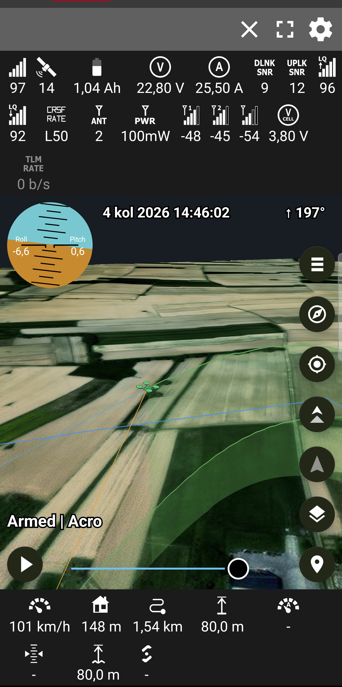

# Android Telemetry Viewer 2.3.1

Live and recorded RC telemetry on a smooth 2D map or real 3D terrain.

This is [juricabi's fork](https://github.com/juricabi/android-taranis-smartport-telemetry).
It supports FrSky S.PORT, CRSF/Tracer/ExpressLRS, Ghost, LTM and MAVLink 1/2 over
Bluetooth, BLE, USB serial and network connections.

**Download:** [GitHub Releases](https://github.com/juricabi/android-taranis-smartport-telemetry/releases)

<p align="center">
  
</p>

## Current state

Version 2.3.1 rebuilds the 3D ground as a camera-driven quadtree and fixes
the 2D map's tile loading, on top of 2.2.1's low-bandwidth telemetry.

- The 3D terrain is the design Google Earth and Cesium use: a quadtree of
  web-mercator tiles that splits wherever its error would show on screen.
  Coarse tiles are the whole region for pennies; the ground is metre-sharp
  under the model. Levels morph into each other, pictures dissolve in, and
  an edge facing a coarser neighbour is stitched onto its line.
- Loading serves the eye: the nearest missing ground builds first, tiles
  clear up one at a time rather than in sweeps, and bare shaded relief
  shows the mountains' shape before the first picture lands. Far rings cap
  their sharpness a step above base, which took a wide view's first picture
  from five seconds to under two.
- The world follows the flight: replaying a flight from another country
  re-anchors the 3D world to it. Beyond that world's edge the locate button
  says so, and the arrows and lines wait until they are back inside.
- Switching to the map parks the 3D world instead of destroying it, so
  switching back redresses from disk in seconds instead of rebuilding for
  twenty. The texture budget scales to the phone's RAM, and about three
  gigabytes of imagery and heights persist on disk.
- Both location arrows stand on the ground as it is currently drawn and
  ride the surface down as detail arrives, instead of waiting buried
  inside a coarse mesh that had not converged yet.
- The 2D map loads everywhere again: the location arrows' special native
  layer stopped raster tiles from drawing on some devices, and they are
  ordinary map symbols now — same look, same ring, no grey map.
- ArduPilot passthrough over CRSF/ExpressLRS and MAVLink High Latency carry
  full telemetry over plain ELRS or satellite/LoRa-class links.
- Every protocol decoder, including the simulator's own byte streams, is
  covered by regression tests.

## Supported telemetry

| Protocol | Main data |
|---|---|
| FrSky S.PORT | GPS, altitude, vario, airspeed, battery, current and sensors |
| CRSF / Crossfire / Tracer / ExpressLRS | GPS, attitude, flight mode, battery, RC and link statistics |
| Ghost (GHST) | GPS, battery and Ghost link statistics/profile |
| LTM | GPS, attitude, status and battery |
| MAVLink 1 and 2 | GPS, global position, attitude, battery, radio, flight mode and status text |
| ArduPilot passthrough over CRSF | flight mode and armed state, GPS status, battery, home distance and direction, velocity, attitude, throttle and status texts (`RC_OPTIONS += 256`, receiver serial on protocol 23) |
| MAVLink High Latency | HIGH_LATENCY2 — position, altitude, heading, speeds, throttle, battery, mode and armed state, one 42-byte message per five seconds (`SERIALn_PROTOCOL = 43`) |

Protocol detection is automatic and latches after the first valid match. The
High Latency preset pins MAVLink 2 instead, since detection would spend ten
seconds waiting for a second frame. Ghost
does not provide attitude, flight mode, vario or airspeed; those fields stay
empty by design.

For Ghost telemetry mirror use EdgeTX with the fix from
[#7610](https://github.com/EdgeTX/edgetx/pull/7610), set the serial port to
**Telemetry mirror**, and use 115200 baud.

## Connections

- Classic Bluetooth serial modules
- BLE telemetry modules
- USB VCP/serial with an OTG connection
- TCP client or server
- UDP listener/broadcast
- TBS Crossfire Wi-Fi WebSocket (`/ws`)

Network presets cover ExpressLRS backpack, Crossfire/Tracer, MAVLink routers,
serial-to-Wi-Fi bridges, localhost and MAVLink High Latency. The High Latency
preset listens over UDP and sends `MAV_CMD_CONTROL_HIGH_LATENCY` to the typed
modem address until the stream answers, since an autopilot boots with that
stream off; sensor timeouts stretch to match the five-second cadence. Wi-Fi
sockets are bound to Wi-Fi so a telemetry access point without internet does
not lose to mobile data.

## Maps, 3D and replay

Map types: OpenStreetMap, OpenTopoMap, satellite, satellite with streets, and 3D
terrain. No API key is required. Tiles are cached as they are used; the 3D
ground keeps about three gigabytes of imagery and heights on disk, so a
revisited region loads from storage rather than the network.

Tracking follows position; chase also follows heading. Both use the same eased
model state in 2D and 3D. Manual gestures remain available while tracking.

Recordings replay at real time or a chosen speed, 3× slower to 10× faster. When
CSV companion data exists, replay restores the original phone position,
accuracy, heading and clock.
The altitude profile compares the flight with terrain and marks minimum clearance.

Altitude notes:

- A dedicated barometric altitude is preferred when the protocol supplies one.
- With only CRSF GPS altitude, the normal and GPS altitude fields may show the
  same value; they are receiving the same valid source.
- The app decides per flight whether reported height is MSL or above launch and
  applies one shared terrain reference to 2D, 3D and the altitude profile.

Flight plans are CSV files containing one `latitude,longitude` pair per line.
They persist, can be toggled individually, and appear in both map views.

## Using the app

1. Pair or attach the telemetry device, or join its Wi-Fi network.
2. Tap **Connect** and choose Bluetooth, BLE, USB or Network.
3. For a network stream, select the matching preset and port.
4. Use the map-type button for 2D or 3D; use tracking or chase as required.

### Simulator

`tools/simflight.py` sends a realistic CRSF flight over UDP:

```sh
python tools/simflight.py --host <phone-ip> --port 8888 \
  --lat <latitude> --lon <longitude> --ground <metres-msl> \
  --style eight --minutes 20
```

In the app choose **Network → TBS Crossfire / Tracer (UDP)** on port 8888.
Use `--style acro` for faster turns, climbs and dives, or `--above-launch` to
exercise relative-altitude handling. `--passthrough` weaves ArduPilot
passthrough frames into the CRSF stream. `--protocol mavlink-hl` sends
HIGH_LATENCY2 instead; add `--wait-enable` and it behaves like a real
autopilot port — silent until the app's enable command arrives, streaming to
whoever asked, stopping when asked to (use the **MAVLink High Latency (UDP)**
preset with the PC's address).

## Building and testing

Current toolchain:

- JDK 21
- Gradle 8.11.1
- Android Gradle Plugin 8.10.1
- Kotlin 2.2.10
- compileSdk 35, minSdk 23, targetSdk 28
- NDK 28.2.13676358
- MapLibre 13.4.1
- ARM64 and ARMv7 APKs

Create `local.properties` with the Android SDK path and `keystore.properties`
from `example_keystore.properties`. The Android Gradle plugin installs the NDK
version declared by the app when it is available through the SDK manager.

```sh
./gradlew :app:testDebugUnitTest :app:lintDebug :app:assembleDebug
./gradlew :app:assembleRelease
```

Outputs:

- `app/build/outputs/apk/debug/app-debug.apk`
- `app/build/outputs/apk/release/app-release.apk`

Debug package: `juricabi.com.telemetry.debug`. Release package:
`juricabi.com.telemetry`. They install side by side.

A `v*` tag triggers `.github/workflows/build-apk.yml`, which builds and attaches
the signed release APK. The release build is the normal distributable artifact.

## Development map

| Area | Main files |
|---|---|
| Screen and frame loop | `ui/MapsActivity.kt` |
| 2D map/camera | `maps/maplibre/MapLibreMapWrapper.kt` |
| Synchronized 2D moving scene | `maps/maplibre/MapLibreMovingLines.kt`, `cpp/moving_lines.cpp` |
| 3D view | `ui/Terrain3DView.kt`, `gl/TerrainRenderer.kt`, `gl/TerrainScene.kt` |
| Connection ownership | `service/DataService.kt`, `protocol/pollers/` |
| Protocols | `protocol/`, `protocol/decoder/` |
| Replay and logs | `protocol/pollers/LogPlayer.kt`, `logger/` |

When adding a sensor, carry it through the complete path: protocol constant and
parser, decoder listener, service forwarding, timeout state, screen view,
logger/replay, preferences/layouts, then a decoder regression test. Keep moving
2D geometry on the shared custom render scene; do not update a GeoJSON source at
frame rate.

## Hardware notes

Built-in radio Bluetooth, telemetry mirror over USB-C, or a network-capable TX
module needs no extra inverter.

For a raw FrSky S.PORT pin use an inverter and an HC-05/HC-06/HM-10-class serial
module at **57600 baud**. Classic Bluetooth modules must be paired in Android
first. Ghost telemetry mirror uses **115200 baud**.


## Known limits

- Android only; Android 6 or newer on ARMv7/ARM64.
- `targetSdk 28` is intentional for this sideloaded APK. A Play Store release
  needs a separate scoped-storage, notification and foreground-service migration.
- Map caching is opportunistic; there is no offline-area downloader yet.
- Legacy UVC camera modules remain in the repository for reference but are not
  included by `settings.gradle` and are not part of the current app.
- Real transport reconnection still needs verification with the corresponding
  physical radio/module; the simulator tests the network and decoder path.

## Lineage

- [CrazyDude1994](https://github.com/CrazyDude1994/android-taranis-smartport-telemetry): original app
- [RomanLut](https://github.com/RomanLut/android-taranis-smartport-telemetry): sensors, protocols, exports and earlier map work
- [Jauler](https://github.com/Jauler/android-taranis-smartport-telemetry): FlightRadar24 and layout work
- This fork: Ghost, network telemetry, MapLibre 2D, 3D terrain, replay/altitude work and current reliability fixes

Also see the [privacy policy](privacy_policy.md) and
[code of conduct](CODE_OF_CONDUCT.md). Use at your own risk.
