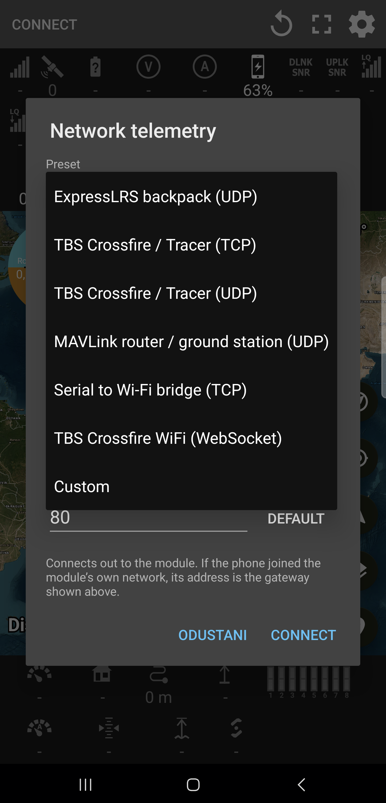

# Android Telemetry Viewer

Watch a model fly on your phone: on a map or over the real ground in three
dimensions, live off the link or replayed from a recording afterwards.

This is **juricabi's fork**. It reads FrSky S.PORT, CRSF (Crossfire, Tracer,
ExpressLRS), **Ghost**, LTM and MAVLink v1/v2, over Bluetooth, Bluetooth LE, USB
serial or **a network socket**.

Latest build: **[Releases](https://github.com/juricabi/android-taranis-smartport-telemetry/releases)**

<p align="center">
  
</p>

---

## What it does

Everything in this section is work done in this fork, on top of what came before
it — see [Lineage](#lineage) at the end for who built what.

### Ghost (GHST) telemetry

ImmersionRC Ghost modules could not be used with the app at all. The protocol is
now detected automatically, exactly like CRSF, over every transport including log
playback.

Decoded: link statistics (RSSI, link quality, SNR, transmit power, RF profile),
battery pack (voltage, current, consumed capacity) and GPS (position, altitude,
ground speed, heading, satellites).

The rate widget shows Ghost's own profile names — Norm, Race, Pure, Long, Race2,
Pure2 — and transmit power in mW, because Ghost uses levels such as 350 mW that
are not in the CRSF power table.

Ghost reports only the receiver side of the link and carries no attitude or
flight mode, so downlink LQ/SNR, antenna, vertical speed, airspeed, the
artificial horizon and flight mode stay empty. That is the protocol, not a
missing feature.

> **Your radio needs EdgeTX with the Ghost telemetry mirror fix**, or the mirror
> port runs at a baud rate that cannot carry Ghost telemetry and the app will
> connect but decode nothing. Upstream fix:
> EdgeTX [#7610](https://github.com/EdgeTX/edgetx/pull/7610) (issue
> [#7609](https://github.com/EdgeTX/edgetx/issues/7609)). Fixed builds for the
> HelloRadioSky V12: <https://github.com/juricabi/edgetx/releases/tag/v12-fixes-1>
>
> Then set a serial port (AUX1, say) to **Telemetry mirror**, hang a Bluetooth
> serial module off it at **115200** baud, pair it, and connect. The protocol
> should be detected as **GHST**.

### Telemetry over the network

Telemetry no longer has to arrive over Bluetooth or USB. **Connect → Network**,
and pick what you have — presets fill in the transport and the usual port:

| Preset | |
|---|---|
| **ExpressLRS backpack (UDP)** | broadcasts MAVLink to 14550; nothing to address |
| **TBS Crossfire / Tracer (TCP)** | the module is a server, normally on 8888 |
| **TBS Crossfire / Tracer (UDP)** | when the module is switched to UDP |
| **TBS Crossfire WiFi (WebSocket)** | `ws://<module>/ws` — CRSF straight off the module |
| **MAVLink router / ground station (UDP)** | mavlink-router, QGroundControl and friends |
| **Serial to Wi-Fi bridge (TCP)** | ESP-link, ser2net and the like |
| **This device (localhost)** | anything producing telemetry on the phone itself |
| **Custom** | anything else, including TCP server mode, where the app waits and the other end dials in |

Nothing about the protocol is assumed — the bytes go through the same detector
every other transport uses, so CRSF, MAVLink v1 and v2, Ghost, FrSky and LTM all
work here for free.

The WebSocket path is worth calling out: on a TBS Crossfire WiFi module it is the
only way in that works on **every firmware**. The MQTT path TBS's own app uses
needs a broker and is broken on 3.20, while `/ws` served CRSF on 2.25, 3.0, 3.10
and 3.20 alike.

**Finding the module.** Pick the network to use (Wi-Fi, hotspot, or this device),
or leave it Automatic. **Find** sweeps the subnet for anything listening on that
port. The gateway is offered as the address, because when the phone joins a
transmitter's own access point, the gateway *is* the transmitter.

**Staying connected.** Sockets are pinned to Wi-Fi, so a module's access point
with no internet on it does not lose to mobile data. The multicast lock is always
held, without which Wi-Fi power saving quietly drops the broadcast telemetry an
ExpressLRS backpack sends. UDP keeps announcing itself for as long as it listens.
A quiet link is never mistaken for a dead one — only the far end closing, or an
error, ends a connection.

<p align="center">
  
</p>

### The ground, in three dimensions

The map-type button has a third entry beside the flat maps. Choose **3D terrain**
and the flight is drawn over real ground: elevation for the shape of it, satellite
imagery for the surface, and the model at the attitude it is actually flying at —
pitch, roll and heading, not an icon pointing north.

| | |
|---|---|
| **The flight** | the line flown, its shadow on the ground beneath, and a translucent curtain between the two, so height reads as a surface rather than a guess |
| **The model** | quad or fixed wing, at its true attitude, lit and outlined so it stays legible against dark imagery |
| **Where you are** | the same blue arrow and accuracy ring the map draws, standing on the terrain |
| **Flight plans** | draped over the ground rather than floating above it |
| **Nearby aircraft** | the same traffic the map shows, as posts standing at their positions |

**The camera.** One finger turns it, two pinch to zoom and tilt. **Tracking**
keeps it on the model; **chase** rides behind the model looking the way it is
going. Both work the same way on the flat map, only one can be on at a time, and
**locate** puts the camera back on your own position. Panning by hand does not
switch tracking off.

**The ground loads around the model, not around the whole flight** — so a flight
fifteen kilometres out and back stays sharp under the model instead of dropping
to a blur to keep a picture of somewhere it flew twenty minutes ago. A replay is
held back until there is a photograph to fly over rather than crossing bare mesh.

### Height, settled properly

A quad reports height above where it armed; a GPS reports height above the sea.
Drawn against terrain the difference is a few hundred metres, and the flight
either floats above the hills or sinks into them.

The app works out which it is being told, once per flight, from the lowest
twentieth of the readings against the ground beneath them — and every view is
measured from the same answer, so the 3D ground, the altitude profile and the
readouts cannot disagree about where a flight was.

### The altitude profile

**Menu → Altitude profile** draws the flight against the ground under it: the
terrain in section, the flight above it, and the clearance between the two, with
the lowest point marked. It answers "how close to that ridge was I", which a
number on a bar cannot.

### A replay that puts the whole scene back

A recording holds what came off the link, which is everything about the model and
nothing about the person holding the phone — yet the line home is drawn to you,
and the distance home is measured from you.

So the CSV recorded beside each flight also holds where the phone was, how good
its fix was and which way it was facing. Replaying, all of it is put back:

- **Where you stood** — an orange arrow with its accuracy ring, and the line home
  drawn to it. Where you are *now* is the usual blue one, and both are drawn at
  once so the two are never confused.
- **The time of day** — the clock reads the real time of the moment being
  replayed, not a share of the way through the file. Where the link went quiet,
  the clock stands still exactly as long as it did on the day.

**Playback controls sit on the replay**, in one dialog off the replay button:
show-where-I-am, real time, and a duration slider that reads *"18:42 of flight in
60 s — 19× faster"* and moves with your finger. **Real time** plays a log at the
speed it was flown; where there is no CSV beside it the switch is disabled and
says why.

### Find my quad

A button on the map shows the last position the model reported: a plus code that
can be typed into any maps app or read out to someone, the coordinates, and the
distance and bearing from where you are standing — with buttons to open it in
Maps, share it or copy it. It survives the link being lost, which is exactly when
you need it.

### Battery, per cell

Volts per cell alongside the pack voltage. The cell count is worked out from the
first reading — from the highest a cell can be, so a freshly charged 6S is not
mistaken for a 7S — or set by hand. Where the flight controller already reports a
single cell, the pack figure is left alone rather than guessed.

### The RF rate means the same thing on every system

Crossfire, Tracer and ExpressLRS all send the same RF mode number and all mean
something different by it: **mode 2 is 150 Hz on a Crossfire and 50 Hz on
ExpressLRS**. The transmitter is now asked what it is (CRSF `DEVICE_INFO`) and
the reading follows its own table, marked **CRSF RATE**, **ELRS RATE** or
**GHST RATE**.

### Everything is drawn on the screen's clock

Telemetry lands a few times a second and the screen draws sixty or more. Taken
literally, everything steps rather than moves. The marker, its heading, the model,
its attitude, the camera and the artificial horizon all ease the same share of the
way on every frame, so nothing on the screen is visibly behind anything else, at
any refresh rate, in either view.

### MAVLink corrections

- `GLOBAL_POSITION_INT` — what ArduPilot and PX4 stream by default — is read in
  both MAVLink 1 and 2, for position, both altitudes, climb rate and heading.
- A heading was being sent by both parsers and read by none, so every MAVLink
  flight used to be drawn facing north.

### Smaller things

- The map type is remembered, including 3D.
- Both position arrows take their colour from the settings.
- The flight line keeps the whole flight — no point limit; long flights are
  thinned for drawing rather than trimmed.
- Nearby aircraft are live-only: real aircraft around where you are now, drawn
  over a replay of last week's flight, were neither the right aircraft nor in the
  right place.
- Settings follow the phone's dark mode.
- Zoom stops where the imagery does, with two further levels drawn from upscaled
  tiles, so the map goes blurry rather than blank.
- The location filter that could latch onto one good fix and freeze your position
  for the rest of a session is gone.
- The location permission is asked for when there is a reason to, not every time
  you return to the app.

## Also in here

Not this fork's work — [RomanLut's](https://github.com/RomanLut/android-taranis-smartport-telemetry),
and still here:

- sensors: airspeed, vertical speed, altitude MSL, throttle, cell voltage,
  telemetry rate, distance to home, distance travelled
- CRSF link quality sensors
- RC channel display — 8 for MAVLink v1, 18 for MAVLink v2, 16 for CRSF<sup>1</sup>
- connection status spoken aloud
- USB VCP cable connection to radios
- GPX and KML export
- rename and delete logs from a long press
- automatic Bluetooth / BLE reconnection

<sup>1</sup> *Channels show with CRSF when they are sent with telemetry. Works
with the PR allowing a direct connection to an ExpressLRS TX module:*
<https://github.com/ExpressLRS/ExpressLRS/pull/2731>

---

## Map types

| Map | Source | Cached |
|-----|--------|--------|
| OpenStreetMap | OSM | as you go |
| OpenTopoMap | OSM | as you go |
| Satellite | ESRI ArcGIS World Imagery | as you go |
| Satellite + Streets | ESRI ArcGIS World Imagery + Transportation + Places overlays | as you go |
| 3D terrain | elevation + satellite imagery | as you go |

No API keys required for any map type.

The flat maps are drawn by **MapLibre**, on the GPU, so a flight line costs the
same to draw however many points are in it — which is why the track keeps every
fix rather than being thinned. Tiles are kept as they are fetched, so a field
you have flown before works without a signal; there is no download-this-area
button yet.

## Flight plan overlay

Import a CSV file with one `latitude,longitude` coordinate per line. Consecutive
points form a path. Multiple CSV files can be imported to show several plans at
once. Plans persist across sessions and can be toggled or deleted from Settings,
and are drawn on the map and draped over the ground in 3D alike.

## Routing telemetry to the application

- a Bluetooth module in the radio, if it has one
- a Bluetooth module you install yourself
- a Crossfire TX with a Bluetooth module
- sniff telemetry from the S.PORT pin into an HC-06 / HM-10 module (wiring below)
- route telemetry to the radio's USB-C port (System → USB-VCP → Telemetry Mirror)
  and connect with an OTG cable — a USB-C↔USB-C cable may not work
- an ELRS build with BLE telemetry output:
  [PR #2305](https://github.com/ExpressLRS/ExpressLRS/pull/2305)
- an ELRS build with Bluetooth telemetry output:
  [PR #2101](https://github.com/ExpressLRS/ExpressLRS/pull/2101)
- **over the network**, from anything above that speaks Wi-Fi — see
  [Telemetry over the network](#telemetry-over-the-network)

## Building

JDK **17 or later** and the Android SDK with platform 35.

```sh
JAVA_HOME=<a JDK 17+> ANDROID_HOME=<the SDK> ./gradlew.bat :app:assembleDebug
adb install -r app/build/outputs/apk/debug/app-debug.apk
```

Gradle 8.11, AGP 8.7, Kotlin 2.0, compileSdk 35 — with **targetSdk deliberately
left at 28**, since this is handed out as an APK rather than through a store.

Package ids: release `juricabi.com.telemetry`, debug
`juricabi.com.telemetry.debug`. Both install side by side, so a debug build can
be tried without disturbing the one you fly with.

### Flying it without a radio

`tools/simflight.py` sends the frames a Crossfire link carries, over UDP:

```sh
python tools/simflight.py --host <the phone> --port 8888 \
    --lat <..> --lon <..> --style acro --minutes 20
```

Then in the app: **Connect → Network → TBS Crossfire / Tracer (UDP)**, same port.
`acro` throws the model about; `eight` is a lazy circuit. It exercises the map,
the track, the horizon, the readouts and the 3D view with the model at its true
attitude.


---

## Hardware and connection

If the radio has Bluetooth built in, or telemetry can be mirrored to its USB-C
port, nothing else is needed — see
[Routing telemetry to the application](#routing-telemetry-to-the-application)
above.

Otherwise, for FrSky S.PORT: an **inverter** and a **Bluetooth serial module**
(HC-05, HC-06, HC-09, HM-10). The inverter goes on the S.PORT pin, the module on
the inverter.

**The module must be set to 57600 baud**, or nothing decodes. Ghost over a
telemetry mirror is the exception — that runs at 115200.


### HC-06 with a MOSFET inverter


### Configuring an HC-06

They ship at 9600 baud. Use any USB-to-serial converter and a serial client —
`screen` on Mac and Linux, [PuTTY](http://www.putty.org/) on Windows.

An HC-06 expects each command typed quickly, within about a second end to end, so
write them in a text editor first and paste them one at a time:

1. `AT+NAMEyournamehere` — no spaces
2. `AT+PIN1234` — no spaces
3. `AT+ENABLEIND0` — skip if the module does not know it
4. `AT+BAUD7` — 57600

**Classic Bluetooth modules must be paired with the phone first** to appear in
the list. **BLE modules should have their PIN disabled** where the module allows
it.

---

## Lineage

This app is not written from scratch, and most of what it does was built by other
people before this fork existed.

| | |
|---|---|
| [CrazyDude1994](https://github.com/CrazyDude1994/android-taranis-smartport-telemetry) | the original app, and the hardware and wiring notes above |
| [RomanLut](https://github.com/RomanLut/android-taranis-smartport-telemetry) | the fork most of the sensors, protocols, exports and map work came from |
| [Jauler](https://github.com/Jauler/android-taranis-smartport-telemetry) | the Flightradar24 traffic overlay and layout work |
| **this fork** | everything under [What it does](#what-it-does) |

Not affiliated with or endorsed by any of them. Use at your own risk.

### Support the original author

- Google Play (the original app): <https://play.google.com/store/apps/details?id=crazydude.com.telemetry>
- YouTube: <https://www.youtube.com/channel/UCjAhODF0Achhc1fynxEXQLg>
- Patreon: <https://www.patreon.com/android_rc_telemetry>
- RCGroups thread: <https://www.rcgroups.com/forums/showthread.php?3284789-iNav-SmartPort-telemetry-viewer-and-logger>
- Telegram group: <https://t.me/joinchat/Gf03BFXI2e48WMvzjLeIjw>

### Special thanks

Carried over from the original README, and still owed:

- **hyperion11** — Ardupilot support
- **Alexey Stankevich** — initial testing, feedback
- **Marios Chrysomallis** — testing BLE support
- **Paweł Spychalski** — contributions, and a video about the app
  (<https://www.youtube.com/watch?v=0-AyP5Y7pCI>)
- **AeroSIM RC** — for sending their simulator so the app could be tested from home
- **[usb-serial-for-android](https://github.com/mik3y/usb-serial-for-android)** — library creators
